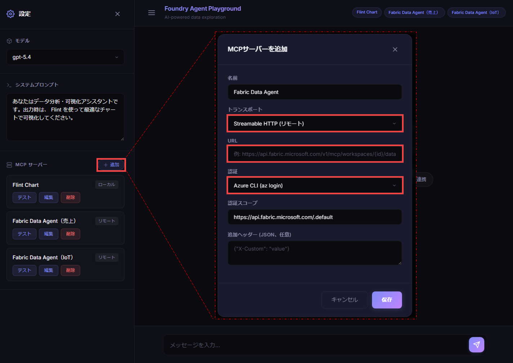
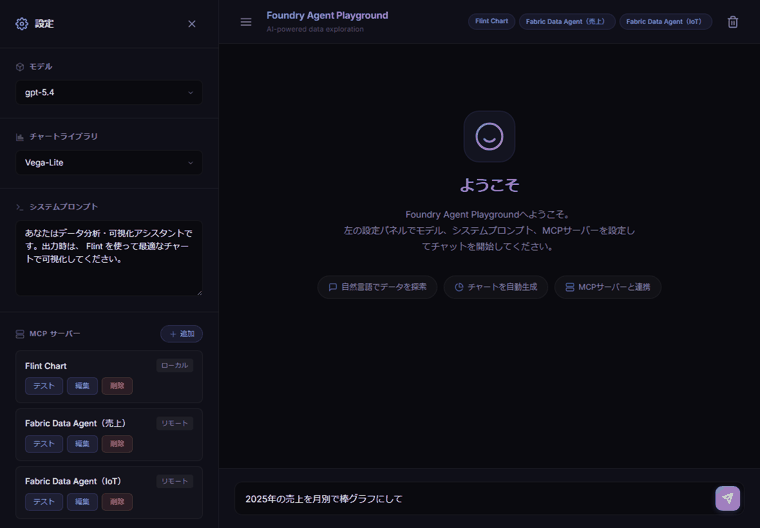

# Flint + Data Agent Playground

**Fabric Data Agent** でデータを分析し、**[Flint Chart](https://github.com/microsoft/flint-chart)** で可視化する流れを試せる、ローカル Web チャットプレイグラウンドです。Microsoft Foundry Agent Service（Python SDK）をバックエンドに、MCP ツールの呼び出しと結果をチャット上で確認しながら対話的に操作できます。

## 主な機能

- **チャット UI**: モデルとシステムプロンプトを選んで対話
- **チャートライブラリ切替**: Vega-Lite / ECharts / Chart.js を設定 UI のプルダウンで動的に選択
- **MCP サーバー管理**: サーバーの追加・編集・削除（UI から）
  - Flint Chart … チャート生成（プリセット済み）
  - Fabric Data Agent … データエージェントへの質問（追加して利用）
- **アクティビティ表示**: 1 ターンの MCP 実行・出力を折りたたみでまとめて表示

## 必要なもの

- Python 3.11+
- Node.js 18+（Flint MCP の `npx` 用）
- Azure CLI（`az login` 済み）
- Microsoft Foundry プロジェクト（モデルをデプロイ済み）
- **公開済み（published）の Fabric Data Agent**

## クイックスタート

```bash
python -m venv .venv
.venv\Scripts\activate        # Windows

pip install -r requirements.txt

copy .env.example .env        # .env の PROJECT_ENDPOINT を設定

az login
python main.py
```

起動後、ブラウザで http://localhost:8000 を開きます。

## Fabric Data Agent を追加する
以下の手順で UI から追加してください。

1. 左の設定パネルの「＋ 追加」を押します。
2. 以下の項目を入力
    - トランスポート：**Streamable HTTP**
    - URL：「**ご自身の Fabric Data Agent MCP エンドポイント**」
    - 認証：**Azure CLI**

```
https://api.fabric.microsoft.com/v1/mcp/workspaces/{WorkspaceId}/dataagents/{DataAgentId}/agent
```

`az login` のトークン（スコープ `https://api.fabric.microsoft.com/.default`）で接続します。
詳細: https://learn.microsoft.com/ja-jp/fabric/data-science/data-agent-mcp-server



## 仕組み

```
ブラウザ (Chat UI)
      │  HTTP / SSE
FastAPI バックエンド  ──►  Microsoft Foundry（モデル推論）
      │
      └─►  MCP サーバー（Flint Chart / Fabric Data Agent）
```

1. ユーザーの質問をモデルに送信
2. モデルが MCP ツールを呼び出し、バックエンドが実行
3. 結果をモデルに返し、最終回答とチャートを表示

### デモ

データについて質問すると、Fabric Data Agent が集計し、Flint がグラフを描画します。



## ライセンス

[Apache License 2.0](LICENSE)
